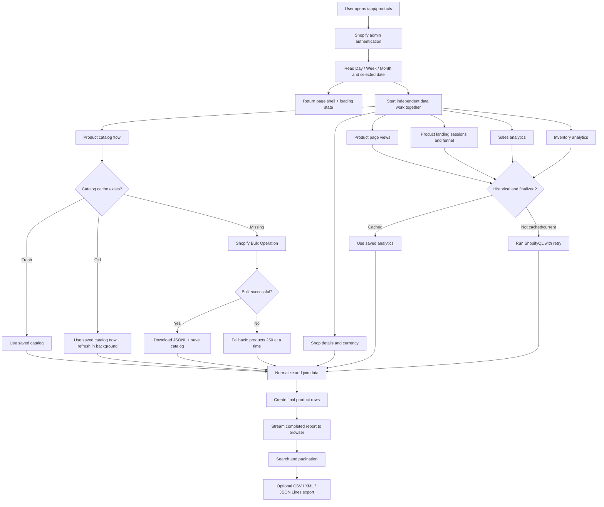

# Audit Bot — Product Audit Data Flow

> Ye document `/app/products` page ka complete flow simple Hinglish me explain karta hai: user click se Shopify/database tak aur final table/export tak.

## Quick mental model

System ke 4 main parts hain:

1. **Browser/UI** — user date select karta hai aur table dekhta hai.
2. **Audit Bot server** — requests coordinate aur data combine karta hai.
3. **Shopify** — products aur analytics deta hai.
4. **Local database/cache** — repeat data save karke next load fast karta hai.

## High-level flowchart



---

## Step-by-step detailed flow

## Step 1 — User endpoint open karta hai

Endpoint:

```text
/app/products
```

Optional URL parameters:

```text
?filterType=day&date=2026-08-12
?filterType=week&date=2026-08-12
?filterType=month&date=2026-08
?debug=1
```

`debug=1` raw Shopify responses allow karta hai. Normal mode me raw JSON browser ko nahi bheja jata.

## Step 2 — Authentication

`authenticate.admin(request)` verify karta hai ki request valid Shopify admin session se aa rahi hai.

Output:

- `admin`: Shopify Admin GraphQL calls ke liye helper.
- `session.shop`: current store identity, e.g. `example.myshopify.com`.

Store identity cache key me use hoti hai, taaki store A aur store B ka data mix na ho.

Failure result:

- Authentication error boundary handle karegi.
- Data fetching start nahi hoga.

## Step 3 — Selected timeline calculate hoti hai

UI selection ko exact `start` aur `end` dates me convert kiya jata hai.

Examples:

| Selection | Start | End |
|---|---:|---:|
| Day: Aug 12 | 2026-08-12 | 2026-08-12 |
| Week containing Aug 12 | Monday | Sunday |
| Month: Aug 2026 | 2026-08-01 | 2026-08-31 |

Ye dates sessions, sales aur inventory ShopifyQL queries me jati hain.

Product catalog is timeline se independent hai.

## Step 4 — Page shell pehle show hoti hai

Server complete report ka Promise browser ko stream karta hai.

User ko blank page ke badle:

```text
Loading product report…
Fetching and matching data for [selected range]
```

Filter change ke time existing report visible reh sakta hai aur updating message show hota hai.

Export incomplete load ke time disabled rahta hai.

## Step 5 — Six independent jobs ek saath start hote hain

```text
1. Product catalog
2. Shop URL + currency
3. Product page views
4. Product landing sessions and funnel
5. Sales
6. Inventory
```

Inme dependency nahi hai, isliye parallel start hote hain.

Total wait ideally slowest job ke equal hota hai—not all jobs ka sum.

## Step 6 — Product catalog retrieval

File: `app/product-catalog-cache.server.js`

### Case A: fresh cache

Cache under 6 hours old:

```text
Database → saved products → report
```

Debug status:

```text
Product catalog: cache
```

### Case B: stale cache

Cache over 6 hours old:

```text
Old saved products immediately → report
                         ↘ background refresh
```

Debug status:

```text
Product catalog: stale-cache-refreshing
```

### Case C: no cache

1. Shopify Bulk Operation start.
2. Every second status check.
3. Maximum 90 seconds wait.
4. Completed JSONL file download.
5. Har line ko product object me parse.
6. Products title se sort.
7. Database me store.

Debug status:

```text
Product catalog: bulk
```

### Bulk failure fallback

Bulk operation fail/timeout ho toh:

```text
products(first: 250) → next cursor → next 250 → ...
```

Maximum 100 pages safety cap hai, meaning up to 25,000 products.

## Step 7 — Shop details retrieval

Shopify Admin GraphQL se:

- Default currency
- Primary store URL
- MyShopify domain

Currency money formatting me use hoti hai.

Product URL is format se banta hai:

```text
{primary-store-url}/products/{product-handle}
```

## Step 8 — Analytics cache decision

File: `app/analytics-cache.server.js`

Sessions, sales aur inventory ke liye separately check hota hai.

### Current/recent period

End date last 3 days ke andar hai:

```text
Always fetch live ShopifyQL
```

### Finalized historical period

End date 3 days se older hai:

```text
Cache hit → saved result
Cache miss → ShopifyQL → save → result
```

Error ya incomplete/truncated result save nahi hota.

## Step 9 — ShopifyQL queries

### Product page views query

`web_performance` dataset se rows `page_path` aur `micro_session_id` ke combination par grouped milti hain. Sirf `page_type = 'Product'` rows li jati hain.

Meaning:

```text
Product page selected period me kitni baar load/view hui
```

Ek customer session me same product page 3 baar load kare toh 3 page views ho sakte hain.

Join key: `/products/{handle}` URL se product handle.

### Product sessions calculation

Same query ke opaque `micro_session_id` values har product ke liye temporary `Set` me add hote hain. Set duplicate value ko ek hi baar rakhta hai.

```text
Product + session ABC + 3 page loads
→ Page Views = 3
→ Product Sessions = Set(ABC).size = 1
```

Same session different product dekhe toh dono products ke against separately count hoti hai. Individual session IDs final table/Excel me nahi dikhte aur database analytics cache me save nahi hote; request complete hote hi memory se discard ho jate hain.

### Product landing sessions query

Per product landing-page path:

- Sessions
- Sessions with cart additions
- Sessions reaching checkout
- Sessions completing checkout
- Conversion rate

Join key: product **handle**, extracted from `/products/{handle}` path.

Meaning:

```text
Kitni sessions ki first page ye product page thi
```

All query parameters, variant URLs aur campaign extensions handle ke basis par same product total me add hote hain. Individual URL list UI/export me store nahi hoti, kyunki report ko sirf combined numeric metric chahiye.

### Sales query

Per `product_id`:

- Gross sales
- Orders containing the product
- Quantity ordered
- Net items sold
- Reversed quantity
- Discounts
- Sales reversals
- Net sales
- Shipping charges
- Return fees
- Taxes
- Total sales

Join key: numeric Shopify product ID.

Blank `product_id` sale row order-level/unattributed amount represent kar sakti hai. App usko products me forcefully divide nahi karti; report informational warning show karti hai.

### Inventory query

Per `product_id`:

- First day in inventory for selected range
- Starting inventory units
- Ending inventory units

Join key: numeric Shopify product ID.

### Retry behavior

Temporary error:

```text
Attempt 1 fails
→ wait 750 ms
→ Attempt 2 fails
→ wait 1.5 sec
→ Attempt 3
```

Permanent parse/query error retry nahi hota.

Every ShopifyQL query me explicit `LIMIT 100000` hai, taaki Shopify ka silent 1,000-row default cap data cut na kare.

## Step 10 — Data normalization

ShopifyQL row kabhi array aur kabhi named object format me aa sakti hai. Code dono ko common object format me convert karta hai.

Example normalized sales row:

```json
{
  "product_id": "8383449006114",
  "total_sales": "799.00"
}
```

## Step 11 — Lookup maps bante hain

Fast matching ke liye temporary dictionaries banti hain:

```text
sessionByHandle[handle]
landingPageByHandle[handle]
salesByProduct[productId]
inventoryByProduct[productId]
```

Isse each product ke liye full analytics list dobara scan nahi karni padti.

Multiple landing paths ke values add hote hain, overwrite nahi.

## Step 12 — Final product row banti hai

Har catalog product ke liye final row:

- Product ID
- Title
- Status
- Product type
- Tags
- URL
- Created at
- First day in inventory
- Starting inventory
- Ending inventory
- Product page views
- Product sessions
- Product landing sessions
- Orders containing the product
- Quantity ordered, net items sold and reversed quantity
- Gross sales, discounts, sales reversals, net sales, shipping charges, return fees, taxes and total sales in store currency

Missing analytics ka default normally zero/null hota hai, taaki ek missing dataset poori table crash na kare.

## Step 13 — Browser rendering

Browser me:

- 50 rows per page
- Search title, ID, type, status, tags par
- Search deferred so typing freeze na ho
- CSS hover—JavaScript mouse work nahi

## Step 14 — Report export

User `Export` menu me pehle scope choose karta hai:

- Current page: current pagination page ke maximum 50 products.
- All results: current date range aur search filter ke all matching products.

Phir format choose karta hai:

- CSV: spreadsheet-compatible rows.
- XML: structured `<productAudit>` document.
- JSON Lines: one JSON product per line.

Browser selected rows ko text format me serialize karke local file download karta hai. Server/Shopify ko export ke liye extra request nahi jati. Export report load/update ke during disabled hota hai.

---

## Error location guide

| Visible symptom | Likely stage | First check |
|---|---|---|
| Authentication/login error | Step 2 | Shopify session and token |
| Products blank, analytics rows present | Step 6 | Catalog status, Prisma client/cache table |
| Sales zero for some products | Steps 9–11 | Row limit, product ID mapping, selected dates |
| Sessions zero but sales present | Steps 9–11 | Product handle and landing-page path |
| Inventory blank | Step 9 | Inventory query and Shopify tracking |
| Page loading for long time first visit | Step 6 | Bulk operation status/fallback |
| Old product details visible | Step 6 | Cache age/background refresh |
| Old historical analytics | Step 8 | Analytics cache grace/version |
| Export unavailable | Steps 4/14 | Report still updating or no matching products |

---

## Debug panel meaning

### Product catalog status

- `cache`: fresh saved catalog used.
- `stale-cache-refreshing`: old saved catalog shown; refresh background me.
- `bulk`: first catalog created through Shopify bulk export.
- `unavailable`: catalog retrieval failed.

Status ke saath `refreshed` date aur exact local time last successful catalog update batata hai. Example:

```text
Product catalog: cache · refreshed Aug 12, 2026, 4:18 PM
```

Ye error nahi hai; informational status hai.

### Query details

- `x-request-id`: Shopify support trace ID.
- `rows`: returned rows.
- `time`: request duration.
- `attempts`: Shopify call attempts.
- `cache: hit`: historical saved response.
- `cache: miss`: historical response first time fetched and saved.
- `truncated`: requested row limit hit; report incomplete ho sakta hai.
- `HTTP Response JSON: null`: normal mode me expected, because heavy raw response browser ko intentionally nahi bheja gaya. `?debug=1` raw response enable karta hai.

---

## Maintenance checklist after data-flow changes

1. `decision.md` me dated decision add/update.
2. `flow.md` me affected steps update.
3. Prisma schema change ho toh migration add.
4. `prisma generate` run.
5. Dev server restart.
6. ESLint run.
7. Production build run.
8. One current and one historical range test.
9. Debug status and retry/cache fields inspect.
10. Current-page and all-results exports in CSV, XML and JSON Lines verify.

Export control Product Audit content ke top-right me render hota hai. `s-page` header slot use nahi hota, because dropdown ko position karne wala normal HTML wrapper us slot me reliably visible nahi tha.

Product table apne `70vh` scroll area ke andar move karti hai. Header row top par aur first `#` column left par sticky rehte hain; top-left cell dono scroll directions me fixed rehta hai.

Product `Orders` sales dataset se `product_id` ke against join hote hain. One order containing multiple products har included product ko one order deta hai. Behavioral sessions/page views Shopify ke reporting pipeline se aate hain aur very recent activity sales ke baad visible ho sakti hai. Exact product-added-to-cart event current ShopifyQL landing-session metric ka part nahi hai.

## Configurable report builder flow

1. Server custom `start`/`end` ko Feb 1-style 18-full-month boundary aur today ke beech validate karta hai.
2. Web performance, landing sessions, sales aur inventory daily grain par parallel fetch hote hain.
3. Daily rows product catalog ID/handle se join hoti hain.
4. User Dimensions add/remove/reorder karta hai; selected combination grouping key banti hai.
5. Additive metrics sum; inventory earliest/latest snapshot leti hai.
6. User Metrics add/remove/reorder karta hai; totals, table and export selected metrics follow karte hain.
7. Right-side Filters grouped report rows ko filter karte hain.
8. Table 50 grouped rows per page render karti hai; header and first selected dimension sticky hain.
