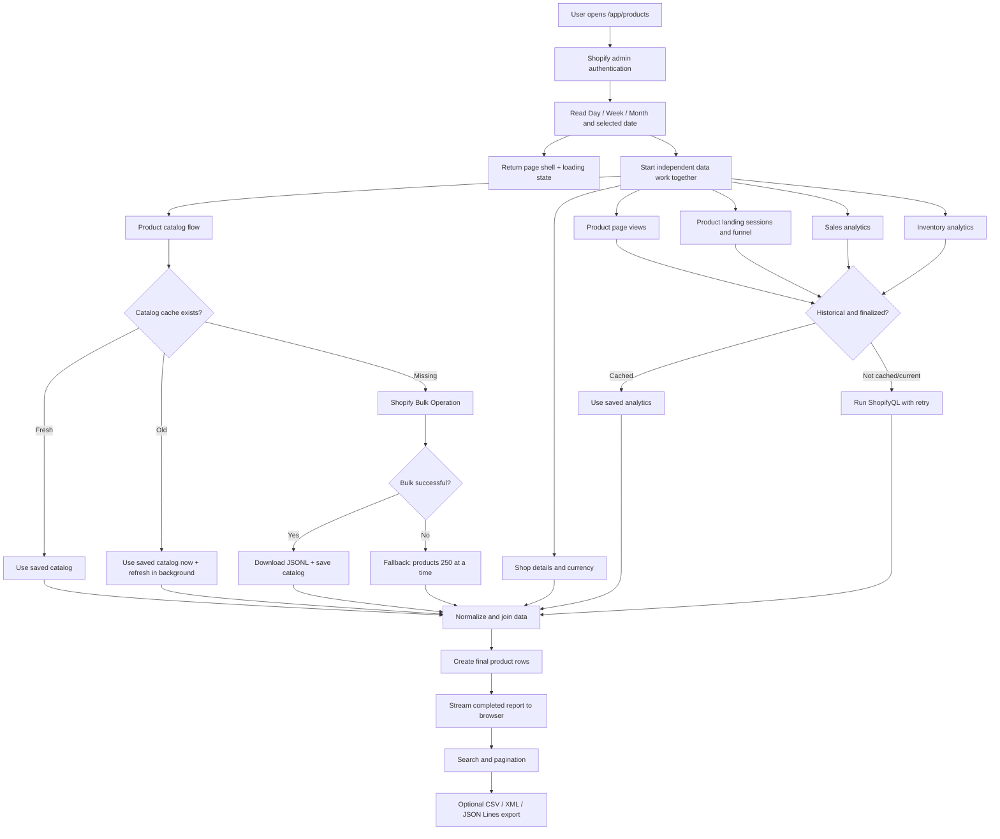

# Audit Bot — Product Audit Data Flow

> Ye document `/app/products` page ka complete flow simple Hinglish me explain karta hai: user click se Shopify/database tak aur final table/export tak.

## Quick mental model

System ke 4 main parts hain:

1. **Browser/UI** — user date select karta hai aur table dekhta hai.
2. **Audit Bot server** — requests coordinate aur data combine karta hai.
3. **Shopify** — products aur analytics deta hai.
4. **Local database/cache** — repeat data save karke next load fast karta hai.

## High-level flowchart



---

## Step-by-step detailed flow

## Step 1 — User endpoint open karta hai

Endpoint:

```text
/app/products
```

Optional URL parameters:

```text
?filterType=day&date=2026-08-12
?filterType=week&date=2026-08-12
?filterType=month&date=2026-08
?debug=1
```

`debug=1` raw Shopify responses allow karta hai. Normal mode me raw JSON browser ko nahi bheja jata.

## Step 2 — Authentication

`authenticate.admin(request)` verify karta hai ki request valid Shopify admin session se aa rahi hai.

Output:

- `admin`: Shopify Admin GraphQL calls ke liye helper.
- `session.shop`: current store identity, e.g. `example.myshopify.com`.

Store identity cache key me use hoti hai, taaki store A aur store B ka data mix na ho.

Failure result:

- Authentication error boundary handle karegi.
- Data fetching start nahi hoga.

## Step 3 — Selected timeline calculate hoti hai

UI selection ko exact `start` aur `end` dates me convert kiya jata hai.

Examples:

| Selection              |      Start |        End |
| ---------------------- | ---------: | ---------: |
| Day: Aug 12            | 2026-08-12 | 2026-08-12 |
| Week containing Aug 12 |     Monday |     Sunday |
| Month: Aug 2026        | 2026-08-01 | 2026-08-31 |

Ye dates sessions, sales aur inventory ShopifyQL queries me jati hain.

Product catalog is timeline se independent hai.

## Step 4 — Page shell pehle show hoti hai

Server complete report ka Promise browser ko stream karta hai.

User ko blank page ke badle:

```text
Loading product report…
Fetching and matching data for [selected range]
```

Filter change ke time existing report visible reh sakta hai aur updating message show hota hai.

Export incomplete load ke time disabled rahta hai.

## Step 5 — Six independent jobs ek saath start hote hain

```text
1. Product catalog
2. Shop URL + currency
3. Product page views
4. Product landing sessions and funnel
5. Sales
6. Inventory
```

Inme dependency nahi hai, isliye parallel start hote hain.

Total wait ideally slowest job ke equal hota hai—not all jobs ka sum.

## Step 6 — Product catalog retrieval

File: `app/product-catalog-cache.server.js`

### Case A: fresh cache

Cache under 6 hours old:

```text
Database → saved products → report
```

Debug status:

```text
Product catalog: cache
```

### Case B: stale cache

Cache over 6 hours old:

```text
Old saved products immediately → report
                         ↘ background refresh
```

Debug status:

```text
Product catalog: stale-cache-refreshing
```

### Case C: no cache

1. Shopify Bulk Operation start.
2. Every second status check.
3. Maximum 90 seconds wait.
4. Completed JSONL file download.
5. Har line ko product object me parse.
6. Products title se sort.
7. Database me store.

Debug status:

```text
Product catalog: bulk
```

### Bulk failure fallback

Bulk operation fail/timeout ho toh:

```text
products(first: 250) → next cursor → next 250 → ...
```

Maximum 100 pages safety cap hai, meaning up to 25,000 products.

## Step 7 — Shop details retrieval

Shopify Admin GraphQL se:

- Default currency
- Primary store URL
- MyShopify domain

Currency money formatting me use hoti hai.

Product URL is format se banta hai:

```text
{primary-store-url}/products/{product-handle}
```

## Step 8 — Analytics cache decision

File: `app/analytics-cache.server.js`

Sessions, sales aur inventory ke liye separately check hota hai.

### Current/recent period

End date last 3 days ke andar hai:

```text
Always fetch live ShopifyQL
```

### Finalized historical period

End date 3 days se older hai:

```text
Cache hit → saved result
Cache miss → ShopifyQL → save → result
```

Error ya incomplete/truncated result save nahi hota.

## Step 9 — ShopifyQL queries

### Discarded product page engagement query

`web_performance.page_loads` and `micro_session_id` are no longer queried or calculated. Product Page Views and Product Sessions are unavailable in the report because their source did not provide sufficiently consistent data. This removes one live, uncached ShopifyQL request from every report load.

### Product landing sessions query

Per product landing-page path:

- Sessions
- Sessions with cart additions
- Sessions reaching checkout
- Sessions completing checkout
- Conversion rate

Join key: product **handle**, extracted from `/products/{handle}` path.

Meaning:

```text
Kitni sessions ki first page ye product page thi
```

All query parameters, variant URLs aur campaign extensions handle ke basis par same product total me add hote hain. Individual URL list UI/export me store nahi hoti, kyunki report ko sirf combined numeric metric chahiye.

### Sales query

Per `product_id`:

- Gross sales
- Orders containing the product
- Quantity ordered
- Net items sold
- Reversed quantity
- Discounts
- Sales reversals
- Net sales
- Shipping charges
- Return fees
- Taxes
- Total sales

Join key: numeric Shopify product ID.

Blank `product_id` sale row order-level/unattributed amount represent kar sakti hai. App usko products me forcefully divide nahi karti; report informational warning show karti hai.

### Inventory query

Per `product_id`:

- First day in inventory for selected range
- Starting inventory units
- Ending inventory units

Join key: numeric Shopify product ID.

### Retry behavior

Temporary error:

```text
Attempt 1 fails
→ wait 750 ms
→ Attempt 2 fails
→ wait 1.5 sec
→ Attempt 3
```

Permanent parse/query error retry nahi hota.

Every ShopifyQL query me explicit `LIMIT 100000` hai, taaki Shopify ka silent 1,000-row default cap data cut na kare.

## Step 10 — Data normalization

ShopifyQL row kabhi array aur kabhi named object format me aa sakti hai. Code dono ko common object format me convert karta hai.

Example normalized sales row:

```json
{
  "product_id": "8383449006114",
  "total_sales": "799.00"
}
```

## Step 11 — Lookup maps bante hain

Fast matching ke liye temporary dictionaries banti hain:

```text
sessionByHandle[handle]
landingPageByHandle[handle]
salesByProduct[productId]
inventoryByProduct[productId]
```

Isse each product ke liye full analytics list dobara scan nahi karni padti.

Multiple landing paths ke values add hote hain, overwrite nahi.

## Step 12 — Final product row banti hai

Har catalog product ke liye final row:

- Product ID
- Title
- Status
- Product type
- Tags
- URL
- Created at
- First day in inventory
- Starting inventory
- Ending inventory
- Product page views
- Product sessions
- Product landing sessions
- Orders containing the product
- Quantity ordered, net items sold and reversed quantity
- Gross sales, discounts, sales reversals, net sales, shipping charges, return fees, taxes and total sales in store currency

Missing analytics ka default normally zero/null hota hai, taaki ek missing dataset poori table crash na kare.

## Step 13 — Browser rendering

Browser me:

- 50 rows per page
- Search title, ID, type, status, tags par
- Search deferred so typing freeze na ho
- CSS hover—JavaScript mouse work nahi

## Step 14 — Report export

User `Export` menu me pehle scope choose karta hai:

- Current page: current pagination page ke maximum 50 products.
- All results: current date range aur search filter ke all matching products.

Phir format choose karta hai:

- CSV: spreadsheet-compatible rows.
- XML: structured `<productAudit>` document.
- JSON Lines: one JSON product per line.

Browser selected rows ko text format me serialize karke local file download karta hai. Server/Shopify ko export ke liye extra request nahi jati. Export report load/update ke during disabled hota hai.

---

## Error location guide

| Visible symptom                        | Likely stage | First check                                   |
| -------------------------------------- | ------------ | --------------------------------------------- |
| Authentication/login error             | Step 2       | Shopify session and token                     |
| Products blank, analytics rows present | Step 6       | Catalog status, Prisma client/cache table     |
| Sales zero for some products           | Steps 9–11   | Row limit, product ID mapping, selected dates |
| Sessions zero but sales present        | Steps 9–11   | Product handle and landing-page path          |
| Inventory blank                        | Step 9       | Inventory query and Shopify tracking          |
| Page loading for long time first visit | Step 6       | Bulk operation status/fallback                |
| Old product details visible            | Step 6       | Cache age/background refresh                  |
| Old historical analytics               | Step 8       | Analytics cache grace/version                 |
| Export unavailable                     | Steps 4/14   | Report still updating or no matching products |

---

## Debug panel meaning

### Product catalog status

- `cache`: fresh saved catalog used.
- `stale-cache-refreshing`: old saved catalog shown; refresh background me.
- `bulk`: first catalog created through Shopify bulk export.
- `unavailable`: catalog retrieval failed.

Status ke saath `refreshed` date aur exact local time last successful catalog update batata hai. Example:

```text
Product catalog: cache · refreshed Aug 12, 2026, 4:18 PM
```

Ye error nahi hai; informational status hai.

### Query details

- `x-request-id`: Shopify support trace ID.
- `rows`: returned rows.
- `time`: request duration.
- `attempts`: Shopify call attempts.
- `cache: hit`: historical saved response.
- `cache: miss`: historical response first time fetched and saved.
- `truncated`: requested row limit hit; report incomplete ho sakta hai.
- `HTTP Response JSON: null`: normal mode me expected, because heavy raw response browser ko intentionally nahi bheja gaya. `?debug=1` raw response enable karta hai.

---

## Maintenance checklist after data-flow changes

1. `decision.md` me dated decision add/update.
2. `flow.md` me affected steps update.
3. Prisma schema change ho toh migration add.
4. `prisma generate` run.
5. Dev server restart.
6. ESLint run.
7. Production build run.
8. One current and one historical range test.
9. Debug status and retry/cache fields inspect.
10. Current-page and all-results exports in CSV, XML and JSON Lines verify.

Export control Product Audit content ke top-right me render hota hai. `s-page` header slot use nahi hota, because dropdown ko position karne wala normal HTML wrapper us slot me reliably visible nahi tha.

Product table apne `70vh` scroll area ke andar move karti hai. Header row top par aur first `#` column left par sticky rehte hain; top-left cell dono scroll directions me fixed rehta hai.

Product `Orders` sales dataset se `product_id` ke against join hote hain. One order containing multiple products har included product ko one order deta hai. Behavioral sessions/page views Shopify ke reporting pipeline se aate hain aur very recent activity sales ke baad visible ho sakti hai. Exact product-added-to-cart event current ShopifyQL landing-session metric ka part nahi hai.

## Configurable report builder flow

1. Server custom `start`/`end` ko Feb 1-style 18-full-month boundary aur today ke beech validate karta hai.
2. Web performance, landing sessions, sales aur inventory daily grain par parallel fetch hote hain.
3. Daily rows product catalog ID/handle se join hoti hain.
4. User Dimensions add/remove/reorder karta hai; selected combination grouping key banti hai.
5. Additive metrics sum; inventory earliest/latest snapshot leti hai.
6. User Metrics add/remove/reorder karta hai; totals, table and export selected metrics follow karte hain.
7. Right-side Filters grouped report rows ko filter karte hain.
8. Table 50 grouped rows per page render karti hai; header and first selected dimension sticky hain.
   Top report toolbar page heading ke just neeche custom start/end range left aur Export action right par render karti hai.

Header sort selection filtered grouped rows par pagination se pehle apply hoti hai. Sorted rows table pages aur export dono ko feed karti hain.

Table fixed column widths and fixed-layout rendering use karti hai, so sorting visible row values badalne par horizontal layout shift nahi hota. Header chevrons fixed-width SVG slot me render hote hain.

## Product Audit page placement

1. Page heading ke neeche top row me date-range card left aur separate Export control right render hote hain.
2. Main report area desktop par two columns me render hota hai.
3. Left column ka order: selected metric totals, pagination aur products table. Filtering right-side Filters panel se hoti hai.
4. Right column: Metrics, Dimensions aur Filters; scrolling ke waqt desktop par sticky rehta hai.
5. Sirf mobile screen width 760px se kam ho toh right controls table ke saath single-column flow me stack ho jaate hain.

Responsive correction: report canvas embedded viewport ki available grey width use karta hai. Sidebar 300–360px responsive width aur viewport-height sticky scroll area use karti hai. Left report remaining width leta hai; metric totals reflow hote hain aur wide tables apne internal horizontal scroll me rehte hain. Sidebar ab sirf mobile widths below 760px par stack hoti hai.

Metrics and Dimensions selected lists independently scroll karti hain. Their headers and add controls list ke bahar fixed rehte hain; selected-item order continues to control resultant table column order.

Filters rows bhi independent list me render hoti hain. Multiple filters 260px list height cross karein toh thin internal scrollbar activate hota hai; Filters heading and add button visible rehte hain.

Current sidebar behavior: Metrics, Dimensions aur Filters headings collapsible dropdown controls hain. Open section all selected rows show karta hai; no nested list scrollbar is used. Complete right sidebar single thin scrollbar se move hoti hai.

Right controls panel has its own viewport-aware 420–720px height and outer scrollbar. Page scroll moves left report content independently; sidebar scroll reveals every selected metric, dimension and filter inside the open collapsible sections.

Current height flow: browser panel ka live top position measure karta hai, viewport bottom tak remaining pixels calculate karta hai, and that exact value right controls height banti hai. Resize aur page scroll par value recalculate hoti hai. All three sections start expanded and one combined panel scrollbar reveals their complete selected contents.

## Unique Orders total flow

1. Product sales breakdown continues to group by day and product ID for table rows.
2. A parallel cached `FROM sales SHOW orders` query fetches the selected range's store-level unique order count without product grouping.
3. Top Selected Metric Totals uses this unique value for Orders; it never sums product-row Orders.
4. Inventory metrics remain selectable in the table but are excluded from top total cards because inventory snapshots are not meaningful additive totals.

5. Table header ke below Summary row selected result columns summarize karti hai. Numeric columns filtered rows sum karti hain, date columns earliest displayed value leti hain, text columns dash show karti hain, and Orders dedicated unique order total use karta hai.

6. Filter field type operator list decide karta hai: numeric metrics comparison/range operators use karte hain; text fields equality, membership, contains, prefix and suffix operators use karte hain. Multi-value text input commas par split hota hai before case-insensitive matching.

## Automatic ShopifyQL range recovery

1. Requested date range first one ShopifyQL request me runs.
2. Temporary rate limit gets up to three exponential-backoff attempts.
3. Retry still fails, or response exactly 100,000 rows hits, then system pauses two seconds.
4. Date range two inclusive halves me splits.
5. Left and right chunks sequentially run; any failing/truncated chunk recursively splits again down to one day.
6. Successful daily-grain rows concatenate and feed normal product joining.
7. Debug `chunks` recovery request count shows; `catalog last refreshed` and `report generated` separate timestamps are displayed.

## Selected metric totals (updated 2026-08-20)

1. Product-level sales query continues to build the product rows and table Summary values.
2. A separate cached `FROM sales SHOW orders` query runs without product grouping.
3. Shopify's returned `orders` value is shown in the Selected metric totals Orders card, preventing duplicate counting when one order contains multiple products.
4. Inventory metrics are skipped only while rendering the Selected metric totals cards; they remain selectable and visible in the table.

## New Arrival Analysis page (created 2026-08-20)

Navigation currently opens `/app/new-arrivals` inside the existing authenticated app layout. No loader, Shopify query, cohort calculation, or external integration runs yet.

# New Arrival Analysis flow (2026-08-20)

1. Authenticate the Shopify admin request.
2. Resolve the requested month range (15 months by default, maximum latest 18 months, current month through yesterday).
3. Load the product catalog and shop currency.
4. For every selected month, fetch product inventory, product sales, and total store sales. Finished months are read from cache when available; temporary failures retry automatically.
5. Join analytics rows to the catalog by numeric Shopify Product ID and attach current title and Product Type.
6. Determine each product's launch month using the Python rule: first positive starting inventory, ending inventory, or sales month.
7. Calculate Overall and Product Type cohort matrices, including SKU, inventory, sales, and denominator percentages.
8. Calculate the product-level Cohort Details rows.
9. Render either the New Arrival Analysis tab or the paginated Cohort Details tab.

# Public acquisition and in-app activation flow (2026-08-31)

1. A public visitor sees the product outcome, interface preview, core operator advantages, and workflow.
2. The primary calls to action move the visitor to the Shopify domain form.
3. Submitting the store domain continues through the existing secure Shopify authentication route.
4. An authenticated merchant lands in the Command Center with store connection status and three report paths.
5. The activation checklist directs a new merchant to Product Audit first, then New Arrival Analysis.
6. The operator playbook explains a concrete first workflow: compare ending inventory with sales and landing sessions to identify at-risk stock.
7. Report routes retain their existing data loading, caching, and calculation behavior; the redesigned home does not prefetch heavy analytics.

# New Arrival report interaction flow (2026-08-31)

1. The loader fetches the same monthly inventory, sales, store sales, and landing-session datasets through the existing cache.
2. Product catalog metadata adds title, handle, Product Type, URL, and optional thumbnail without changing analytics totals.
3. The Analysis tab can display all metrics or a sales, inventory, or traffic subset without another server request.
4. The Cohort Details tab searches and filters the complete loaded result, then sorts it, then paginates it into 50-row pages.
5. Density changes only table spacing. Export serializes the full filtered result in CSV, JSON Lines, or XML.
6. Sticky headers remain inside the single table scroll container. Product, Type, and Launch Cohort stay frozen while month blocks scroll horizontally.

## 2026-08-31 — Metric explanation flow

1. User opens New Arrival Analysis; report data and table state work as before.
2. The `Calculation Logic & Formulas` button opens an isolated 480px methodology drawer.
3. The drawer explains cohort assignment, cohort lifespan, matrix metrics, and product-detail formulas without triggering data requests.
4. Hovering or focusing a metric's `ⓘ` icon opens a fixed-position tooltip rendered outside the table scroll container.
5. Closing the drawer or tooltip leaves the selected tab, filters, sorting, pagination, focus mode, and density unchanged.

## 2026-08-31 — New Arrival sales calculation

1. Fetch product-level `total_sales` grouped by product for each reporting month.
2. Sum product `total_sales` for all products belonging to a cohort to calculate `NA sales`.
3. Fetch store-level `total_sales` for the same month.
4. Calculate `NA Sales % = cohort total_sales / store total_sales × 100`.

## 2026-08-31 — New Arrival dimension flow

1. Read `classification` (`type` by default) and `interval` (`month` by default) from the report URL.
2. Build either calendar-month periods or Monday–Sunday week periods within the selected dates.
3. Fetch and cache inventory, Total Sales, orders, store Total Sales, and landing sessions for each period.
4. Attach Shopify Product Type and all Shopify product tags to every product-period record.
5. Calculate Overall from unique Product IDs, ensuring a multi-tag product is counted once.
6. Build category matrices from Product Type or Product Tag membership. In tag mode, one Product ID can contribute to multiple tag matrices.
7. Render and export the matrix and detail tables using the selected classification and period labels.

## 2026-09-01 — Product Tag matrix rendering flow

1. Load all valid product tags from the cached Shopify product catalog.
2. Calculate Overall from unique Product IDs.
3. Calculate each tag matrix using every Product ID carrying that tag.
4. Omit empty launch-cohort rows from tag/category matrices while retaining all real period values.
5. Render only the Overall table initially; a collapsed tag table is created in the browser only when that tag section is opened.

## 2026-09-01 — Staged tag preparation flow

1. Initial Product Tag request calculates Overall once and returns the ordered tag list without full tag matrices.
2. The browser displays Overall and all tag names in collapsed form.
3. A two-request queue prepares the first 20 tags in the background.
4. Intersection Observer prioritizes tags approaching the viewport; hover, keyboard focus, and opening also request a tag immediately.
5. A single-tag loader response rebuilds that matrix from analytics cache and includes all selected cohort rows.
6. The table DOM is mounted only when its tag section is expanded.
7. Export requests the complete category report on demand, then produces the selected file format.

## 2026-09-01 — Final click-only category flow

1. Initial report returns Overall, Cohort Details, and ordered Product Type or Product Tag names with category matrices deferred.
2. All category names render in collapsed form without background requests.
3. Opening one category sends a lightweight `categoryOnly` request for that category.
4. The response includes every selected cohort row, including cohorts with no category activity.
5. The loaded matrix remains available in that component for instant close/reopen behavior.
6. Rapid multi-category clicks are protected by a maximum two-request queue.
7. Export separately requests the full report and includes all categories, whether opened on screen or not.

## 2026-09-01 — Custom matrix-column flow

1. Initialize the report with all matrix metric keys selected in their default order.
2. The Custom Columns dropdown lists every metric with a checkbox and drag handle.
3. Toggling a checkbox immediately updates visible matrix columns.
4. Dragging a metric changes the shared ordered metric-key list.
5. Overall, subsequently loaded categories, and exported files consume the same selected ordered list.
6. Reset restores all metrics and the original order.

## 2026-09-01 — Loading-state flow

1. Date, classification, and Month/Week changes enter React Router's pending navigation state.
2. Keep custom dates, quick ranges, classification, grouping, and calculation-logic controls visible.
3. Replace debug information, report tabs, and results below the controls with the report loader.
4. On loader completion, React Router swaps in the new report atomically.
5. Metric changes show a loader in place of matrix results during the local column update.
6. Cohort Detail search/filter changes show a loader in place of the detail table during filtering.

## 2026-09-01 — Weekly grouped-query flow

1. Switching to Week sets the start to Monday five completed weeks ago and the end to yesterday; quick presets use the same rule for 5, 8, or 12 weeks.
2. Generate every Monday-start weekly period that intersects the selected range.
3. Divide those periods into groups of at most seven weeks.
4. Process groups one after another. Within each group, run four parallel ShopifyQL queries grouped by `week`: inventory, product sales/orders, store sales, and landing sessions.
5. Split each grouped response back into individual weekly records using its Shopify week value.
6. If a group reaches 100,000 rows, divide that group into two smaller groups and repeat until it fits or reaches one week.
7. Feed the resulting weekly records into the same cohort engine, then render the report with the applied start/end dates synchronized in both the date summary and date fields.

## 2026-09-02 — New Arrival matrix scrolling

1. Keep the month-group header at the top of the matrix scroll container.
2. Keep the metric-header row directly below it.
3. Keep the Summary row directly below both header rows while cohort rows scroll underneath.
4. Apply density-specific offsets and preserve the frozen Cohort column at every sticky-row intersection.
