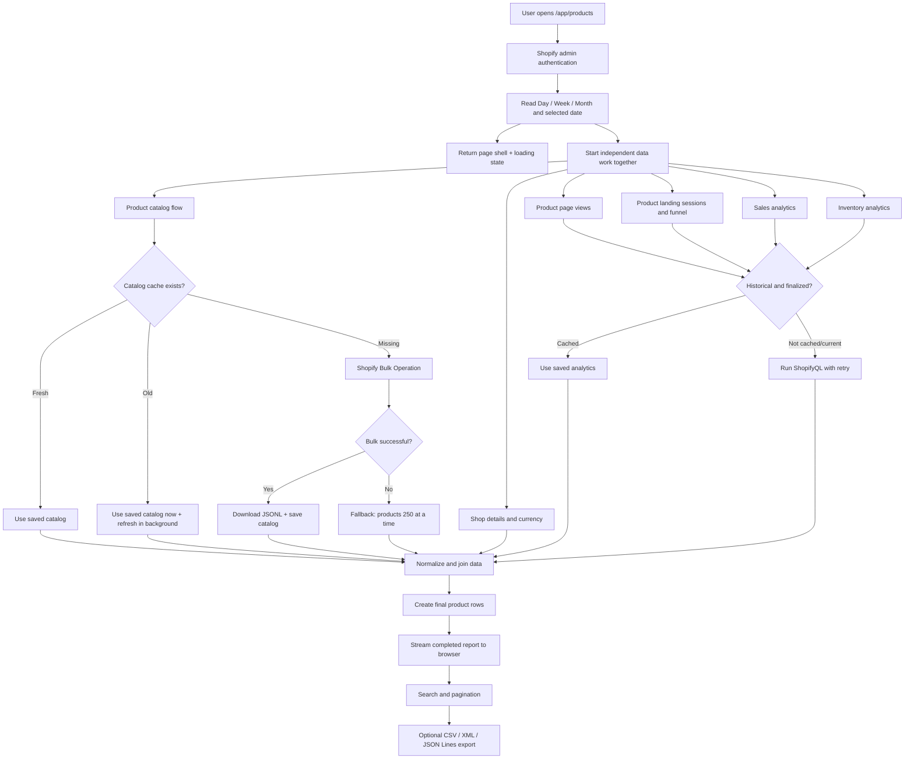

# Audit Bot — Product Audit Data Flow

> Ye document `/app/products` page ka complete flow simple Hinglish me explain karta hai: user click se Shopify/database tak aur final table/export tak.

## Quick mental model

System ke 4 main parts hain:

1. **Browser/UI** — user date select karta hai aur table dekhta hai.
2. **Audit Bot server** — requests coordinate aur data combine karta hai.
3. **Shopify** — products aur analytics deta hai.
4. **Local database/cache** — repeat data save karke next load fast karta hai.

## High-level flowchart


```mermaid
flowchart TD
    A["User opens /app/products"] --> B["Shopify admin authentication"]
    B --> C["Read Day / Week / Month and selected date"]
    C --> D["Return page shell + loading state"]
    C --> E["Start independent data work together"]

    E --> F["Product catalog flow"]
    E --> G["Shop details and currency"]
    E --> H["Product page views"]
    E --> I["Product landing sessions and funnel"]
    E --> J["Sales analytics"]
    E --> AA["Inventory analytics"]

    F --> K{"Catalog cache exists?"}
    K -->|"Fresh"| L["Use saved catalog"]
    K -->|"Old"| M["Use saved catalog now + refresh in background"]
    K -->|"Missing"| N["Shopify Bulk Operation"]
    N --> O{"Bulk successful?"}
    O -->|"Yes"| P["Download JSONL + save catalog"]
    O -->|"No"| Q["Fallback: products 250 at a time"]

    H --> R{"Historical and finalized?"}
    I --> R
    J --> R
    AA --> R
    R -->|"Cached"| S["Use saved analytics"]
    R -->|"Not cached/current"| T["Run ShopifyQL with retry"]

    L --> U["Normalize and join data"]
    M --> U
    P --> U
    Q --> U
    G --> U
    S --> U
    T --> U

    U --> V["Create final product rows"]
    V --> W["Stream completed report to browser"]
    W --> X["Search and pagination"]
    X --> Y["Optional CSV / XML / JSON Lines export"]
```

---

## Step-by-step detailed flow

## Step 1 — User endpoint open karta hai

Endpoint:

```text
/app/products
```

Optional URL parameters:

```text
?filterType=day&date=2026-08-12
?filterType=week&date=2026-08-12
?filterType=month&date=2026-08
?debug=1
```

`debug=1` raw Shopify responses allow karta hai. Normal mode me raw JSON browser ko nahi bheja jata.

## Step 2 — Authentication

`authenticate.admin(request)` verify karta hai ki request valid Shopify admin session se aa rahi hai.

Output:

- `admin`: Shopify Admin GraphQL calls ke liye helper.
- `session.shop`: current store identity, e.g. `example.myshopify.com`.

Store identity cache key me use hoti hai, taaki store A aur store B ka data mix na ho.

Failure result:

- Authentication error boundary handle karegi.
- Data fetching start nahi hoga.

## Step 3 — Selected timeline calculate hoti hai

UI selection ko exact `start` aur `end` dates me convert kiya jata hai.

Examples:

| Selection              |      Start |        End |
| ---------------------- | ---------: | ---------: |
| Day: Aug 12            | 2026-08-12 | 2026-08-12 |
| Week containing Aug 12 |     Monday |     Sunday |
| Month: Aug 2026        | 2026-08-01 | 2026-08-31 |

Ye dates sessions, sales aur inventory ShopifyQL queries me jati hain.

Product catalog is timeline se independent hai.

## Step 4 — Page shell pehle show hoti hai

Server complete report ka Promise browser ko stream karta hai.

User ko blank page ke badle:

```text
Loading product report…
Fetching and matching data for [selected range]
```

Filter change ke time existing report visible reh sakta hai aur updating message show hota hai.

Export incomplete load ke time disabled rahta hai.

## Step 5 — Six independent jobs ek saath start hote hain

```text
1. Product catalog
2. Shop URL + currency
3. Product page views
4. Product landing sessions and funnel
5. Sales
6. Inventory
```

Inme dependency nahi hai, isliye parallel start hote hain.

Total wait ideally slowest job ke equal hota hai—not all jobs ka sum.

## Step 6 — Product catalog retrieval

File: `app/product-catalog-cache.server.js`

### Case A: fresh cache

Cache under 6 hours old:

```text
Database → saved products → report
```

Debug status:

```text
Product catalog: cache
```

### Case B: stale cache

Cache over 6 hours old:

```text
Old saved products immediately → report
                         ↘ background refresh
```

Debug status:

```text
Product catalog: stale-cache-refreshing
```

### Case C: no cache

1. Shopify Bulk Operation start.
2. Every second status check.
3. Maximum 90 seconds wait.
4. Completed JSONL file download.
5. Har line ko product object me parse.
6. Products title se sort.
7. Database me store.

Debug status:

```text
Product catalog: bulk
```

### Bulk failure fallback

Bulk operation fail/timeout ho toh:

```text
products(first: 250) → next cursor → next 250 → ...
```

Maximum 100 pages safety cap hai, meaning up to 25,000 products.

## Step 7 — Shop details retrieval

Shopify Admin GraphQL se:

- Default currency
- Primary store URL
- MyShopify domain

Currency money formatting me use hoti hai.

Product URL is format se banta hai:

```text
{primary-store-url}/products/{product-handle}
```

## Step 8 — Analytics cache decision

File: `app/analytics-cache.server.js`

Sessions, sales aur inventory ke liye separately check hota hai.

### Current/recent period

End date last 3 days ke andar hai:

```text
Always fetch live ShopifyQL
```

### Finalized historical period

End date 3 days se older hai:

```text
Cache hit → saved result
Cache miss → ShopifyQL → save → result
```

Error ya incomplete/truncated result save nahi hota.

## Step 9 — ShopifyQL queries

### Discarded product page engagement query

`web_performance.page_loads` and `micro_session_id` are no longer queried or calculated. Product Page Views and Product Sessions are unavailable in the report because their source did not provide sufficiently consistent data. This removes one live, uncached ShopifyQL request from every report load.

### Product landing sessions query

Per product landing-page path:

- Sessions
- Sessions with cart additions
- Sessions reaching checkout
- Sessions completing checkout
- Conversion rate

Join key: product **handle**, extracted from `/products/{handle}` path.

Meaning:

```text
Kitni sessions ki first page ye product page thi
```

All query parameters, variant URLs aur campaign extensions handle ke basis par same product total me add hote hain. Individual URL list UI/export me store nahi hoti, kyunki report ko sirf combined numeric metric chahiye.

### Sales query

Per `product_id`:

- Gross sales
- Orders containing the product
- Quantity ordered
- Net items sold
- Reversed quantity
- Discounts
- Sales reversals
- Net sales
- Shipping charges
- Return fees
- Taxes
- Total sales

Join key: numeric Shopify product ID.

Blank `product_id` sale row order-level/unattributed amount represent kar sakti hai. App usko products me forcefully divide nahi karti; report informational warning show karti hai.

### Inventory query

Per `product_id`:

- First day in inventory for selected range
- Starting inventory units
- Ending inventory units

Join key: numeric Shopify product ID.

### Retry behavior

Temporary error:

```text
Attempt 1 fails
→ wait 750 ms
→ Attempt 2 fails
→ wait 1.5 sec
→ Attempt 3
```

Permanent parse/query error retry nahi hota.

Every ShopifyQL query me explicit `LIMIT 100000` hai, taaki Shopify ka silent 1,000-row default cap data cut na kare.

## Step 10 — Data normalization

ShopifyQL row kabhi array aur kabhi named object format me aa sakti hai. Code dono ko common object format me convert karta hai.

Example normalized sales row:

```json
{
  "product_id": "8383449006114",
  "total_sales": "799.00"
}
```

## Step 11 — Lookup maps bante hain

Fast matching ke liye temporary dictionaries banti hain:

```text
sessionByHandle[handle]
landingPageByHandle[handle]
salesByProduct[productId]
inventoryByProduct[productId]
```

Isse each product ke liye full analytics list dobara scan nahi karni padti.

Multiple landing paths ke values add hote hain, overwrite nahi.

## Step 12 — Final product row banti hai

Har catalog product ke liye final row:

- Product ID
- Title
- Status
- Product type
- Tags
- URL
- Created at
- First day in inventory
- Starting inventory
- Ending inventory
- Product page views
- Product sessions
- Product landing sessions
- Orders containing the product
- Quantity ordered, net items sold and reversed quantity
- Gross sales, discounts, sales reversals, net sales, shipping charges, return fees, taxes and total sales in store currency

Missing analytics ka default normally zero/null hota hai, taaki ek missing dataset poori table crash na kare.

## Step 13 — Browser rendering

Browser me:

- 50 rows per page
- Search title, ID, type, status, tags par
- Search deferred so typing freeze na ho
- CSS hover—JavaScript mouse work nahi

## Step 14 — Report export

User `Export` menu me pehle scope choose karta hai:

- Current page: current pagination page ke maximum 50 products.
- All results: current date range aur search filter ke all matching products.

Phir format choose karta hai:

- CSV: spreadsheet-compatible rows.
- XML: structured `<productAudit>` document.
- JSON Lines: one JSON product per line.

Browser selected rows ko text format me serialize karke local file download karta hai. Server/Shopify ko export ke liye extra request nahi jati. Export report load/update ke during disabled hota hai.

---

## Error location guide

| Visible symptom                        | Likely stage | First check                                   |
| -------------------------------------- | ------------ | --------------------------------------------- |
| Authentication/login error             | Step 2       | Shopify session and token                     |
| Products blank, analytics rows present | Step 6       | Catalog status, Prisma client/cache table     |
| Sales zero for some products           | Steps 9–11   | Row limit, product ID mapping, selected dates |
| Sessions zero but sales present        | Steps 9–11   | Product handle and landing-page path          |
| Inventory blank                        | Step 9       | Inventory query and Shopify tracking          |
| Page loading for long time first visit | Step 6       | Bulk operation status/fallback                |
| Old product details visible            | Step 6       | Cache age/background refresh                  |
| Old historical analytics               | Step 8       | Analytics cache grace/version                 |
| Export unavailable                     | Steps 4/14   | Report still updating or no matching products |

---

## Debug panel meaning

### Product catalog status

- `cache`: fresh saved catalog used.
- `stale-cache-refreshing`: old saved catalog shown; refresh background me.
- `bulk`: first catalog created through Shopify bulk export.
- `unavailable`: catalog retrieval failed.

Status ke saath `refreshed` date aur exact local time last successful catalog update batata hai. Example:

```text
Product catalog: cache · refreshed Aug 12, 2026, 4:18 PM
```

Ye error nahi hai; informational status hai.

### Query details

- `x-request-id`: Shopify support trace ID.
- `rows`: returned rows.
- `time`: request duration.
- `attempts`: Shopify call attempts.
- `cache: hit`: historical saved response.
- `cache: miss`: historical response first time fetched and saved.
- `truncated`: requested row limit hit; report incomplete ho sakta hai.
- `HTTP Response JSON: null`: normal mode me expected, because heavy raw response browser ko intentionally nahi bheja gaya. `?debug=1` raw response enable karta hai.

---

## Maintenance checklist after data-flow changes

1. `decision.md` me dated decision add/update.
2. `flow.md` me affected steps update.
3. Prisma schema change ho toh migration add.
4. `prisma generate` run.
5. Dev server restart.
6. ESLint run.
7. Production build run.
8. One current and one historical range test.
9. Debug status and retry/cache fields inspect.
10. Current-page and all-results exports in CSV, XML and JSON Lines verify.

Export control Product Audit content ke top-right me render hota hai. `s-page` header slot use nahi hota, because dropdown ko position karne wala normal HTML wrapper us slot me reliably visible nahi tha.

Product table apne `70vh` scroll area ke andar move karti hai. Header row top par aur first `#` column left par sticky rehte hain; top-left cell dono scroll directions me fixed rehta hai.

Product `Orders` sales dataset se `product_id` ke against join hote hain. One order containing multiple products har included product ko one order deta hai. Behavioral sessions/page views Shopify ke reporting pipeline se aate hain aur very recent activity sales ke baad visible ho sakti hai. Exact product-added-to-cart event current ShopifyQL landing-session metric ka part nahi hai.

## Configurable report builder flow

1. Server custom `start`/`end` ko Feb 1-style 18-full-month boundary aur today ke beech validate karta hai.
2. Web performance, landing sessions, sales aur inventory daily grain par parallel fetch hote hain.
3. Daily rows product catalog ID/handle se join hoti hain.
4. User Dimensions add/remove/reorder karta hai; selected combination grouping key banti hai.
5. Additive metrics sum; inventory earliest/latest snapshot leti hai.
6. User Metrics add/remove/reorder karta hai; totals, table and export selected metrics follow karte hain.
7. Right-side Filters grouped report rows ko filter karte hain.
8. Table 50 grouped rows per page render karti hai; header and first selected dimension sticky hain.
   Top report toolbar page heading ke just neeche custom start/end range left aur Export action right par render karti hai.

Header sort selection filtered grouped rows par pagination se pehle apply hoti hai. Sorted rows table pages aur export dono ko feed karti hain.

Table fixed column widths and fixed-layout rendering use karti hai, so sorting visible row values badalne par horizontal layout shift nahi hota. Header chevrons fixed-width SVG slot me render hote hain.

## Product Audit page placement

1. Page heading ke neeche top row me date-range card left aur separate Export control right render hote hain.
2. Main report area desktop par two columns me render hota hai.
3. Left column ka order: selected metric totals, pagination aur products table. Filtering right-side Filters panel se hoti hai.
4. Right column: Metrics, Dimensions aur Filters; scrolling ke waqt desktop par sticky rehta hai.
5. Sirf mobile screen width 760px se kam ho toh right controls table ke saath single-column flow me stack ho jaate hain.

Responsive correction: report canvas embedded viewport ki available grey width use karta hai. Sidebar 300–360px responsive width aur viewport-height sticky scroll area use karti hai. Left report remaining width leta hai; metric totals reflow hote hain aur wide tables apne internal horizontal scroll me rehte hain. Sidebar ab sirf mobile widths below 760px par stack hoti hai.

Metrics and Dimensions selected lists independently scroll karti hain. Their headers and add controls list ke bahar fixed rehte hain; selected-item order continues to control resultant table column order.

Filters rows bhi independent list me render hoti hain. Multiple filters 260px list height cross karein toh thin internal scrollbar activate hota hai; Filters heading and add button visible rehte hain.

Current sidebar behavior: Metrics, Dimensions aur Filters headings collapsible dropdown controls hain. Open section all selected rows show karta hai; no nested list scrollbar is used. Complete right sidebar single thin scrollbar se move hoti hai.

Right controls panel has its own viewport-aware 420–720px height and outer scrollbar. Page scroll moves left report content independently; sidebar scroll reveals every selected metric, dimension and filter inside the open collapsible sections.

Current height flow: browser panel ka live top position measure karta hai, viewport bottom tak remaining pixels calculate karta hai, and that exact value right controls height banti hai. Resize aur page scroll par value recalculate hoti hai. All three sections start expanded and one combined panel scrollbar reveals their complete selected contents.

## Unique Orders total flow

1. Product sales breakdown continues to group by day and product ID for table rows.
2. A parallel cached `FROM sales SHOW orders` query fetches the selected range's store-level unique order count without product grouping.
3. Top Selected Metric Totals uses this unique value for Orders; it never sums product-row Orders.
4. Inventory metrics remain selectable in the table but are excluded from top total cards because inventory snapshots are not meaningful additive totals.

5. Table header ke below Summary row selected result columns summarize karti hai. Numeric columns filtered rows sum karti hain, date columns earliest displayed value leti hain, text columns dash show karti hain, and Orders dedicated unique order total use karta hai.

6. Filter field type operator list decide karta hai: numeric metrics comparison/range operators use karte hain; text fields equality, membership, contains, prefix and suffix operators use karte hain. Multi-value text input commas par split hota hai before case-insensitive matching.

## Automatic ShopifyQL range recovery

1. Requested date range first one ShopifyQL request me runs.
2. Temporary rate limit gets up to three exponential-backoff attempts.
3. Retry still fails, or response exactly 100,000 rows hits, then system pauses two seconds.
4. Date range two inclusive halves me splits.
5. Left and right chunks sequentially run; any failing/truncated chunk recursively splits again down to one day.
6. Successful daily-grain rows concatenate and feed normal product joining.
7. Debug `chunks` recovery request count shows; `catalog last refreshed` and `report generated` separate timestamps are displayed.

## Selected metric totals (updated 2026-08-20)

1. Product-level sales query continues to build the product rows and table Summary values.
2. A separate cached `FROM sales SHOW orders` query runs without product grouping.
3. Shopify's returned `orders` value is shown in the Selected metric totals Orders card, preventing duplicate counting when one order contains multiple products.
4. Inventory metrics are skipped only while rendering the Selected metric totals cards; they remain selectable and visible in the table.

## New Arrival Analysis page (created 2026-08-20)

Navigation currently opens `/app/new-arrivals` inside the existing authenticated app layout. No loader, Shopify query, cohort calculation, or external integration runs yet.

# New Arrival Analysis flow (2026-08-20)

1. Authenticate the Shopify admin request.
2. Resolve the requested month range (15 months by default, maximum latest 18 months, current month through yesterday).
3. Load the product catalog and shop currency.
4. For every selected month, fetch product inventory, product sales, and total store sales. Finished months are read from cache when available; temporary failures retry automatically.
5. Join analytics rows to the catalog by numeric Shopify Product ID and attach current title and Product Type.
6. Determine each product's launch month using the Python rule: first positive starting inventory, ending inventory, or sales month.
7. Calculate Overall and Product Type cohort matrices, including product, inventory, sales, and denominator percentages.
8. Calculate the product-level Cohort Details rows.
9. Render either the New Arrival Analysis tab or the paginated Cohort Details tab.

# Public acquisition and in-app activation flow (2026-08-31)

1. A public visitor sees the product outcome, interface preview, core operator advantages, and workflow.
2. The primary calls to action move the visitor to the Shopify domain form.
3. Submitting the store domain continues through the existing secure Shopify authentication route.
4. An authenticated merchant lands in the Command Center with store connection status and three report paths.
5. The activation checklist directs a new merchant to Product Audit first, then New Arrival Analysis.
6. The operator playbook explains a concrete first workflow: compare ending inventory with sales and landing sessions to identify at-risk stock.
7. Report routes retain their existing data loading, caching, and calculation behavior; the redesigned home does not prefetch heavy analytics.

# New Arrival report interaction flow (2026-08-31)

1. The loader fetches the same monthly inventory, sales, store sales, and landing-session datasets through the existing cache.
2. Product catalog metadata adds title, handle, Product Type, URL, and optional thumbnail without changing analytics totals.
3. The Analysis tab can display all metrics or a sales, inventory, or traffic subset without another server request.
4. The Cohort Details tab searches and filters the complete loaded result, then sorts it, then paginates it into 50-row pages.
5. Density changes only table spacing. Export serializes the full filtered result in CSV, JSON Lines, or XML.
6. Sticky headers remain inside the single table scroll container. Product, Type, and Launch Cohort stay frozen while month blocks scroll horizontally.

## 2026-08-31 — Metric explanation flow

1. User opens New Arrival Analysis; report data and table state work as before.
2. The `Calculation Logic & Formulas` button opens an isolated 480px methodology drawer.
3. The drawer explains cohort assignment, cohort lifespan, matrix metrics, and product-detail formulas without triggering data requests.
4. Hovering or focusing a metric's `ⓘ` icon opens a fixed-position tooltip rendered outside the table scroll container.
5. Closing the drawer or tooltip leaves the selected tab, filters, sorting, pagination, focus mode, and density unchanged.

## 2026-08-31 — New Arrival sales calculation

1. Fetch product-level `total_sales` grouped by product for each reporting month.
2. Sum product `total_sales` for all products belonging to a cohort to calculate `NA sales`.
3. Fetch store-level `total_sales` for the same month.
4. Calculate `NA Sales % = cohort total_sales / store total_sales × 100`.

## 2026-08-31 — New Arrival dimension flow

1. Read `classification` (`type` by default) and `interval` (`month` by default) from the report URL.
2. Build either calendar-month periods or Monday–Sunday week periods within the selected dates.
3. Fetch and cache inventory, Total Sales, orders, store Total Sales, and landing sessions for each period.
4. Attach Shopify Product Type and all Shopify product tags to every product-period record.
5. Calculate Overall from unique Product IDs, ensuring a multi-tag product is counted once.
6. Build category matrices from Product Type or Product Tag membership. In tag mode, one Product ID can contribute to multiple tag matrices.
7. Render and export the matrix and detail tables using the selected classification and period labels.

## 2026-09-01 — Product Tag matrix rendering flow

1. Load all valid product tags from the cached Shopify product catalog.
2. Calculate Overall from unique Product IDs.
3. Calculate each tag matrix using every Product ID carrying that tag.
4. Omit empty launch-cohort rows from tag/category matrices while retaining all real period values.
5. Render only the Overall table initially; a collapsed tag table is created in the browser only when that tag section is opened.

## 2026-09-01 — Staged tag preparation flow

1. Initial Product Tag request calculates Overall once and returns the ordered tag list without full tag matrices.
2. The browser displays Overall and all tag names in collapsed form.
3. A two-request queue prepares the first 20 tags in the background.
4. Intersection Observer prioritizes tags approaching the viewport; hover, keyboard focus, and opening also request a tag immediately.
5. A single-tag loader response rebuilds that matrix from analytics cache and includes all selected cohort rows.
6. The table DOM is mounted only when its tag section is expanded.
7. Export requests the complete category report on demand, then produces the selected file format.

## 2026-09-01 — Final click-only category flow

1. Initial report returns Overall, Cohort Details, and ordered Product Type or Product Tag names with category matrices deferred.
2. All category names render in collapsed form without background requests.
3. Opening one category sends a lightweight `categoryOnly` request for that category.
4. The response includes every selected cohort row, including cohorts with no category activity.
5. The loaded matrix remains available in that component for instant close/reopen behavior.
6. Rapid multi-category clicks are protected by a maximum two-request queue.
7. Export separately requests the full report and includes all categories, whether opened on screen or not.

## 2026-09-01 — Custom matrix-column flow

1. Initialize the report with all matrix metric keys selected in their default order.
2. The Custom Columns dropdown lists every metric with a checkbox and drag handle.
3. Toggling a checkbox immediately updates visible matrix columns.
4. Dragging a metric changes the shared ordered metric-key list.
5. Overall, subsequently loaded categories, and exported files consume the same selected ordered list.
6. Reset restores all metrics and the original order.

## 2026-09-01 — Loading-state flow

1. Date, classification, and Month/Week changes enter React Router's pending navigation state.
2. Keep custom dates, quick ranges, classification, grouping, and calculation-logic controls visible.
3. Replace debug information, report tabs, and results below the controls with the report loader.
4. On loader completion, React Router swaps in the new report atomically.
5. Metric changes show a loader in place of matrix results during the local column update.
6. Cohort Detail search/filter changes show a loader in place of the detail table during filtering.

## 2026-09-01 — Weekly grouped-query flow

1. Switching to Week sets the start to Monday five completed weeks ago and the end to yesterday; quick presets use the same rule for 5, 8, or 12 weeks.
2. Generate every Monday-start weekly period that intersects the selected range.
3. Divide those periods into groups of at most seven weeks.
4. Process groups one after another. Within each group, run four parallel ShopifyQL queries grouped by `week`: inventory, product sales/orders, store sales, and landing sessions.
5. Split each grouped response back into individual weekly records using its Shopify week value.
6. If a group reaches 100,000 rows, divide that group into two smaller groups and repeat until it fits or reaches one week.
7. Feed the resulting weekly records into the same cohort engine, then render the report with the applied start/end dates synchronized in both the date summary and date fields.

## 2026-09-02 — New Arrival matrix scrolling

1. Keep the month-group header at the top of the matrix scroll container.
2. Keep the metric-header row directly below it.
3. Keep the Summary row directly below both header rows while cohort rows scroll underneath.
4. Apply density-specific offsets and preserve the frozen Cohort column at every sticky-row intersection.

## 2026-09-04 — Cohort Details column sizing

1. Define the three frozen context columns and every repeated month metric in the table's `colgroup`.
2. Select the shared metric width from the active density: 86px Compact or 104px Comfortable.
3. Calculate the complete table width from the three frozen columns plus `period count × metrics per period × metric width`.
4. Use fixed table layout so grouped month headers, cell content, and available screen space cannot resize an individual column.
5. Repeat the same column definition for every month, keeping month blocks visually aligned while scrolling.

## 2026-09-04 — Grouped-header separator

1. Keep Product, classification, and launch cohort as semantic two-row table headers with visually hidden labels.
2. Render a dedicated 405px merged visual header overlay with all three labels vertically centered across the full header height.
3. Draw the Month-to-Metric separator only across the scrolling month region, beginning after the frozen 405px area.
4. Keep that separator in an independent native sticky layer so scrolling rows cannot cover it.
5. Lock the overlay natively with `position: sticky; top: 0; left: 0` so browser compositing keeps it fixed during fast scrolling.
6. Use a density-matched negative margin to let the table occupy the same starting position beneath the overlay.
7. Keep the overlay above sticky body cells and all scrolling month headers.

## 2026-09-04 — Stable header painting flow

1. Select the density-specific month and metric header heights once on the table scroll container.
2. Use those same values for the native sticky rows and the merged frozen-column header.
3. Render the Month-to-Metric separator as an inset line inside each sticky month header cell.
4. Do not introduce a second sticky divider layer, preventing duplicate lines and scroll-transition movement.

## 2026-09-04 — Native two-axis header flow

1. Render Product, classification, and Launch cohort as real `rowSpan=2` header cells.
2. Freeze those cells vertically at `top: 0` and horizontally using their existing column offsets.
3. Keep the frozen header cells above month headers and table data through a dedicated z-index layer.
4. Let the browser position every header and divider within one table layout, without overlay transforms or negative margins.

## 2026-09-10 — First-cohort lookback flow

1. Preserve the user's exact selected start and end dates for displayed report periods.
2. Build a separate retrospective range from the first day two complete months before the selected start month through the day before the selected start.
3. Fetch product-level inventory and Total Sales activity for that range through the analytics cache.
4. Identify products with starting inventory, ending inventory, or Total Sales greater than zero in the retrospective range.
5. Build normal cohorts from activity inside the selected range.
6. For retrospective matches that also have selected-range activity, replace their calculated launch period with the first displayed cohort.
7. Leave all later cohort assignment and metric calculations unchanged.

## 2026-09-10 — Methodology FAQ flow

1. Open Calculation Logic & Formulas from the report controls.
2. Scroll to Frequently Asked Questions.
3. Expand only the relevant question to see its plain-language answer.
4. Keep all FAQ state local to the drawer so table filters, sorting, density, and pagination remain unchanged.

## 2026-09-10 — Date range selection flow

1. Click the single displayed date range to open one calendar window.
2. Use Month and Year selectors or previous/next arrows to navigate.
3. Select the start date, then select the end date; both values remain local draft state.
4. Use Cancel, outside click, or Escape to close without changing the report.
5. Click Apply to write both dates together to the report URL.
6. Let the existing route loader and loading UI refresh the report once for the completed range.

## 2026-09-10 — Dual-calendar drill-down flow

1. Open the shared range control to see separate Start date and End date calendars.
2. Use the left calendar exclusively to set the start boundary and the right calendar to set the end boundary.
3. Click a period heading to choose a year, then a month, then an exact date; alternatively use the outer month arrows.
4. If a new start exceeds the draft end, align the end to that date; if a new end precedes the draft start, align the start to that date.
5. Keep all changes local until Apply submits both boundaries together.
# 2026-09-11 - Date picker interaction

1. Open the shared date-range picker from either report page.
2. Navigate the Start and End calendars independently with the paired arrows beside each month heading.
3. Click the aligned month heading to choose year, then month, then date.
4. Confirm both draft dates with Apply; closing or cancelling leaves the report range unchanged.
# 2026-09-11 - Monthly quick ranges

1. Use yesterday as the report end date.
2. For Last N months, move back N calendar months and use that month's first day.
3. Include the current partial month, so the output contains N previous calendar months plus the current month.
4. Fetch first-cohort lookback activity grouped by product and carry matching products into the first displayed cohort under the existing eligibility rules.
# 2026-09-11 - Calculation drawer reference flow

1. Open Calculation Logic & Formulas.
2. Use New Arrival Analysis Metrics Dictionary for matrix-column definitions.
3. Use Cohort Details Metrics Dictionary for every metric shown in the product-level table.
4. Read CR % as orders divided by landing sessions and use it directionally, since it excludes sessions that began elsewhere.
5. Use the lookback FAQ to translate the selected start date into its exact pre-range checking window.
# 2026-09-11 - Calculation drawer accordion

1. Open Calculation Logic & Formulas to see the four section headings.
2. Select a heading to expand only the reference content needed.
3. Select the same heading again to collapse it; other report state remains unchanged.
# 2026-09-11 - Cohort Details filters

1. Search by product title, handle, or Product ID.
2. Optionally narrow results by Product Type/Tag and Launch Cohort.
3. Stock status is no longer calculated or applied as a table filter.
# 2026-09-11 - Report navigation after Order Details removal

1. Home links to Product Audit and New Arrival Analysis.
2. Opening either report runs only that report's own catalog and analytics queries.
3. The former `/app/order-details` route and its `orders(first: 250)` GraphQL request no longer exist.
# 2026-09-11 - Product Audit inventory chunk flow

1. Divide the selected date range into consecutive seven-day inventory ranges.
2. Fetch at most two ranges simultaneously; each request retains automatic retry behavior.
3. If a range reaches 100,000 rows, divide that range in half and fetch its smaller ranges.
4. Merge all daily product rows into the same inventory dataset used by the existing Product Audit calculations.
5. Cache each successful range separately and warn only when a one-day range remains truncated or a chunk fails.
# 2026-09-11 - Product Audit date-change feedback

1. Select Start and End dates using the shared dual-calendar picker.
2. Apply the draft range to begin React Router navigation.
3. Keep the date header visible, disable date/export controls, and replace the old report content with a loader.
4. Render debug data, totals, filters, and the product table only after the new range finishes loading.
# 2026-09-11 - Product Audit dimension-change flow

1. User adds, removes, or reorders a dimension.
2. Paint the report loader before changing the active dimension list.
3. Stream through each source row once, updating its group totals and inventory boundaries without storing per-group raw-row arrays.
4. Reuse the completed grouped result for filtering, sorting, totals, and pagination, then reveal the report.

# 2026-09-14 - Product Audit range loading and throttle recovery

1. User applies a new date range and React Router starts navigation with the new `start` and `end` URL values.
2. The visible date card immediately uses those pending URL values while the previous report body is replaced by the loader.
3. Inventory runs in seven-day chunks with a small gap between live ShopifyQL requests.
4. Each chunk first uses the normal per-query automatic retries.
5. If Shopify still rate-limits part of the batch, wait for its shared request budget to recover and retry only failed chunks sequentially.
6. Merge successful and recovered chunks, then display the new report. Show an incomplete-data warning only for chunks that still fail after both recovery passes.

# 2026-09-14 - New Arrival combined workbook export

1. User selects `Excel workbook (both reports)` from either New Arrival export menu.
2. Fetch the complete report with `exportAll=1`, so collapsed Product Type/Tag sections are calculated without requiring the user to open them.
3. Lazy-load ExcelJS after the export action, leaving normal report loading unchanged.
4. Build `New Arrival Analysis` with Overall and all classifications, merged period groups, metric headers, cohort rows and Grand Total rows.
5. Build `Cohort Details` with product columns, linked Product URLs and grouped metric columns for every selected month/week.
6. Apply spreadsheet styling, number formats, filters and freeze panes, then download one `.xlsx` file containing both worksheets.

# 2026-09-15 - Cohort percentage heatmap flow

1. Read the percentage value for a matrix or Cohort Details cell.
2. If it is zero or missing, render neutral gray text without a heatmap background.
3. If it is greater than zero but below 5%, apply the low-performance heatmap.
4. Continue using the existing mid and high thresholds for all other positive values.

# 2026-09-15 - Cohort product hover flow

1. User rests the pointer on, or keyboards into, a product cell.
2. Wait 180ms to distinguish intentional inspection from table scrolling.
3. Measure the product cell and place a fixed 300px card within the visible browser viewport.
4. Render the card through `document.body` with product image, full title, type, launch cohort, Product ID and live storefront link.
5. Remove the card shortly after pointer/focus leaves, without changing table width or row height.

# 2026-09-16 - Product hover presentation

1. Hovering or focusing the product link starts only the custom 180ms intent timer; no native title tooltip is available.
2. Place the 320px card 12px beyond the product cell's right edge and 10px above its top edge, bounded horizontally to the viewport.
3. Render the fully opaque card above all table and Shopify Admin layers with the existing interactive content.

# 2026-09-16 - Live product URL flow

1. Read the shop's live primary domain once with the existing shop metadata request.
2. Combine that domain with each catalog product handle as `/products/{handle}`.
3. Store this canonical storefront URL on the report row without falling back to an Admin URL.
4. Reuse the row URL for the table title, hover-card action, CSV/JSONL/XML exports and combined Excel workbook.

# 2026-09-16 - Cohort Details product search flow

1. If the input contains `/products/{handle}`, extract that handle and match it exactly.
2. Otherwise normalize the entered query and each product's title, handle and ID to lowercase words without punctuation differences.
3. Match the normalized query against product titles first.
4. Compare the normalized words so visually identical titles still match when their original dash or spacing characters differ.
5. If the entered storefront title extends the complete report title with a trailing code, retain the product as a match.
6. Only when no title matches exist, fall back to Product Handle and Product ID matching.
7. Apply Product Type and Launch Cohort filters after the text match as before.

# 2026-09-16 - Supabase monthly analytics rollout

1. Keep the current SQLite-backed Shopify sessions and report cache running while the new Supabase path is introduced independently.
2. Apply the versioned Supabase migration to create stores, products, product tags, product-month metrics, store-month totals and sync-job tables.
3. Configure the project URL and service-role secret only in the server environment; browser clients receive no direct table policy.
4. Import one development store's product catalogue once, then upsert compact monthly facts in batches of at most 500 rows.
5. Treat absent product-month rows as zero activity and retain explicit store-month totals for unique orders and report denominators.
6. Verify report values and measure table/index size for one month, then backfill the remaining 18-month window progressively from newest to oldest.
7. Add server-side reads and pagination only after the stored output matches the existing live ShopifyQL reports.
8. Roll out gradually from one store to five, twenty and fifty while monitoring database size, egress, failed sync jobs and query latency.

# 2026-09-17 - Monthly Supabase sync flow

1. Send an authenticated POST request to `/app/analytics-sync`; a GET request returns the store's latest sync-job status.
2. Verify that no recent sync is already running for the store, then create a running job covering the latest 18 months.
3. Fetch the Shopify product catalogue once and upsert product metadata and current tags in Supabase.
4. Process months from newest to oldest. For each month, fetch inventory, sales, landing sessions and store totals with at most two ShopifyQL requests running together.
5. Retry temporary Shopify failures with increasing waits. If a month remains failed or truncated, record it and continue without replacing that month's stored facts.
6. Match sales and inventory by Product ID and landing sessions by product handle, then upsert compact product-month facts in batches of 500.
7. Save exact store-level orders and sales totals separately, update job progress after every month, and retain only the current 18-month window.
8. Mark the job completed when every month succeeds, partial when some months fail, or failed when setup/catalog work cannot finish.
9. Leave Product Audit and New Arrival Analysis on their existing live data paths until a later validation goal explicitly approves a read-path change.

# 2026-09-18 - NA Inventory FAQ calculation flow

1. Open Calculation Logic & Formulas and expand Frequently Asked Questions.
2. Read cohort NA Inventory as the sum of Ending Inventory in each product's launch period and Starting Inventory in later periods.
3. Build the period denominator by applying that same rule to every eligible store product and adding the results.
4. Calculate NA Inventory % as the selected cohort's NA Inventory divided by that period denominator.
5. For Product Type/Tag sections, restrict only the numerator to the category and retain the all-store denominator.

# 2026-09-18 - Supabase paginated read flow

1. Build the normal filtered Supabase REST request.
2. When the caller asks for a specific limit, return only that requested number of rows.
3. Otherwise request rows in consecutive ranges of 1,000 and append each page.
4. Stop when Supabase returns fewer than 1,000 rows, ensuring the complete product map is available before monthly facts are written.
5. If Shopify still rate-limits an individual month after automatic retries, run a targeted sync for only that failed month and preserve every successful month.
6. Count a store-month product as active only when Starting Inventory, Ending Inventory or Total Sales is greater than zero.

# 2026-09-18 - Supabase reconciliation flow

1. Select representative inventory-heavy and sales-active months before changing any report read path.
2. Fetch fresh product inventory, sales, landing sessions and store totals from ShopifyQL.
3. Join ShopifyQL products to Supabase by Shopify Product ID and join landing sessions through the product handle.
4. Compare all product metric fields and integer minor-unit sales amounts, then compare the store-month summary fields.
5. Treat a ShopifyQL aggregate row without a Product ID as unattributed data rather than a missing catalog product.
6. Require zero identifiable-product and store-summary differences before approving a future database-backed report rollout.

# 2026-09-28 - Store-scoped retention cleanup flow

1. Run retention cleanup only after a complete rolling 18-month sync, never after a targeted one-month retry.
2. Pass the authenticated database store ID together with the oldest month that must be retained.
3. Delete product-month rows only when `store_id` equals that store AND `month` is older than the cutoff.
4. Apply the same two conditions to store-month summary rows.
5. Refuse to run cleanup when the store ID or a valid cutoff date is missing.
6. Keep every row belonging to all other stores, even when those rows are older than the syncing store's cutoff.

# 2026-09-28 - Atomic store-month replacement flow

1. Fetch and validate all required ShopifyQL datasets before changing a stored month.
2. Build the complete product-metric array and one store-summary object for a single store and month.
3. Send the complete payload to one server-only Supabase database function call.
4. Validate that every product in the payload belongs to the selected store before deleting old rows.
5. Delete only the selected store and month, then insert the complete fresh product rows and summary inside one PostgreSQL transaction.
6. Commit the whole replacement together; if validation or insertion fails, PostgreSQL restores the previous complete month automatically.

# 2026-09-28 - Authenticated store analytics access flow

1. Authenticate the Shopify request before any Supabase analytics operation.
2. Derive the shop domain from `session.shop`; never accept a browser-provided store ID or shop domain.
3. Resolve the matching internal `audit_stores.id` once and create a store-scoped server gateway.
4. Route product, tag, monthly metric, retention and sync-job operations through that gateway.
5. Automatically add or overwrite `store_id` on every supported read, write, update and delete operation.
6. Ignore a caller-supplied store filter and retain only the authenticated store filter.
7. Keep the Supabase service-role key on the server and expose no direct analytics-table access to the browser.

# 2026-09-29 - Non-negative inventory reporting flow

1. Save each product-month Starting Inventory and Ending Inventory exactly as Shopify returns it, including a negative value when present.
2. When building a store-month inventory summary, convert each negative product balance to zero before adding the products together.
3. Save only the resulting totals as `audit_store_month_metrics.non_negative_starting_inventory` and `audit_store_month_metrics.non_negative_ending_inventory`.
4. Enforce non-negative store totals again inside PostgreSQL so an incorrect caller cannot save a negative summary.
5. When New Arrival calculations read live or stored product-month data, convert negative inventory to zero before building cohort inventory and the all-product denominator.
6. Apply the existing NA period rule after that conversion: use Ending Inventory in the launch period and Starting Inventory in every later period.

# 2026-09-29 - Product and store order-count flow

1. Fetch Product Orders with ShopifyQL grouped by product. One customer order containing Product A and Product B contributes one Product Order to A and one to B.
2. Store that product-month value as `audit_product_month_metrics.product_orders` and use it only for product/cohort analysis.
3. Fetch Store Unique Orders with a separate ungrouped ShopifyQL store query. The same A+B customer order contributes only one Store Unique Order.
4. Store that exact value as `audit_store_month_metrics.unique_orders` and use it for store-wide cards or totals.
5. Never calculate Store Unique Orders by summing Product Orders. Product Audit's cross-product summary explicitly shows `Not additive` in that column.
6. New Arrival CR remains directional: Product Orders divided by product landing sessions. Its labels and dictionary make clear that it is not a store unique-order conversion rate.

# 2026-09-29 - Product lifecycle and catalogue cleanup flow

1. Start the monthly sync by fetching a fresh complete Shopify product catalogue rather than using the local six-hour cache.
2. Upsert every returned product with its current Shopify status, `catalog_state = present`, and a new `last_seen_at` time.
3. Replace tags only for returned products. Preserve last-known tags for products absent from the new catalogue.
4. After the full catalogue fetch and upsert succeed, mark this store's unseen non-deleted products as `missing` and set `missing_since` once.
5. When Shopify sends an authenticated `products/delete` webhook, set the matching product to `deleted` and record `deleted_at`.
6. Keep all product metadata and monthly facts while any retained 18-month product-month row still references the product.
7. After monthly retention removes expired facts, delete only `missing` or `deleted` products that have no remaining monthly facts and whose missing/deleted date is older than 30 days.
8. Use the database view's Effective Status for future filters: `DELETED`, then `MISSING`, otherwise the current Shopify status.
# Historical handle matching for Supabase monthly sync

1. A fresh Shopify catalogue sync returns each product's current handle.
2. Supabase keeps the current handle open in `audit_product_handle_history`. If it changed, the previous row receives an end time and a new row starts.
3. For each month, the sync loads every handle that was valid during that month.
4. Shopify landing-page paths are matched against both current and historical handles.
5. Matched sessions are written to the relevant product-month row.
6. Unknown or ambiguous handles are written to `audit_unmatched_landing_sessions`, not silently dropped or guessed.
7. Store-month data keeps three separate checks: matched product landing sessions, unmatched product landing sessions, and direct Shopify store sessions.
8. Existing live reports remain unchanged until a later, separately approved database-read switchover.
# Monthly product metadata snapshots

1. The fresh catalogue supplies the product's current title, Product Type, and handle.
2. When a new product-month is first saved, those three values are copied into the monthly fact row.
3. A later resync replaces the month's numeric metrics atomically but retains the already-saved metadata snapshot.
4. Future database-backed historical reports will classify that month from its snapshot. Current-catalog screens can continue using `audit_products`.
5. Tags are not snapshotted; tag filtering continues to mean the product's current tags.
# Atomic tag refresh

1. The full catalogue sync builds the complete tag list and refreshed product-ID list for one authenticated store.
2. One Supabase RPC validates that every product belongs to that store and every tag belongs to a refreshed product.
3. Inside the same database transaction, old tags for those refreshed products are deleted and the complete new set is inserted.
4. If validation, deletion, or insertion fails, PostgreSQL rolls back the complete operation and the previous tags remain available to reports.
# Monthly currency safety

1. Shopify supplies the store currency at the start of each sync.
2. Money is converted to integer minor units using that currency's decimal scale.
3. The currency code is saved on every product-month and store-month row alongside the money values.
4. Existing months keep their saved currency during normal same-currency refreshes.
5. If the incoming currency differs from the existing month, the database rejects the replacement instead of mixing meanings.
6. Future multi-store reporting must group totals by currency unless an explicit exchange-rate conversion policy is implemented.
# Store-timezone date boundaries

1. The sync reads `currencyCode`, `myshopifyDomain`, and `ianaTimezone` from the authenticated Shopify shop.
2. Supabase stores the IANA timezone on that shop's `audit_stores` row.
3. The app converts the current instant into the shop's local calendar date and subtracts one calendar day to find the latest completed date.
4. The rolling 18 months and each ShopifyQL month end are generated from that store-local completed date.
5. Midnight and daylight-saving tests ensure server location cannot move a store's range by one day.

# Clear sync progress tracking

1. Create a sync job with `job_attempt = 1` and every query/row counter at zero.
2. Count every ShopifyQL execution after its first execution as a query retry, including retries hidden inside one monthly job.
3. Count incoming primary report rows as processed, and ask PostgreSQL for actual inserted and deleted rows during atomic replacements.
4. Update the job after catalogue work and after every month so operations can see accurate progress while the sync is running.
5. Record retention removals under rows deleted rather than mixing them into rows written.
6. Save a short one-line error summary while retaining month-level failure details in the job JSON.
7. Continue filling the old attempts and rows-written fields for compatibility, but use the new fields for monitoring and decisions.

# Shopify ID text flow

1. Receive Shopify Product IDs as GraphQL ID strings or decimal strings.
2. Extract only the trailing decimal characters and keep the result as JavaScript text.
3. Match ShopifyQL, catalogue, landing-session, webhook, and report records using that exact text.
4. Store `audit_products.shopify_product_id` as PostgreSQL text and pass text arrays/values to lifecycle database functions.
5. Continue using numeric internal database IDs for relationships, joins, tags, and monthly facts.
6. Reject an already-unsafe JavaScript number so an incorrect rounded ID can never be saved silently.

# Unattributed Shopify data flow

1. Read every ShopifyQL product-level source row and check whether it contains a usable Product ID.
2. Match rows with Product IDs to their normal products. Add all rows without a Product ID into one unattributed bucket for that store and period.
3. In Product Audit, display the bucket as `Unattributed Shopify Data` with status `UNATTRIBUTED`, Product Type `Unknown`, no tags, and no product URL.
4. Preserve its sales and any raw audit inventory returned by Shopify. Leave landing sessions and conversion unavailable because there is no reliable product handle.
5. In New Arrival Analysis, create a separate `Unattributed` row and show only Total Sales and Total Sales %. Do not give it a launch cohort or use it in product-count, inventory, or conversion calculations.
6. Save the period metrics against the store's one protected synthetic database product. Keep real Shopify products identified by their exact Shopify Product ID.
7. Exclude the synthetic product from active-product counts, catalogue lifecycle changes, tag and handle refreshes, delete webhooks, and orphan cleanup.
8. Keep unmatched landing-page sessions in their existing separate reconciliation table; never guess that those sessions belong to unattributed sales.

# Store inventory validation naming flow

1. Save Shopify's original per-product Starting and Ending Inventory in `audit_product_month_metrics`, including negative values.
2. For the store summary, convert each negative product value to zero and then add the products together.
3. Save those calculated totals as `non_negative_starting_inventory` and `non_negative_ending_inventory` in `audit_store_month_metrics`.
4. Use these store fields for validation or future store-level summaries, not as the NA Inventory % denominator.
5. Continue calculating NA Inventory % from product-month rows because its denominator mixes Ending Inventory in a product's launch period with Starting Inventory in later periods.

# New Arrival product-count terminology

1. Count distinct active Product IDs in each cohort and period.
2. Display that count as `NA Products`.
3. Calculate `NA Product %` as active cohort products divided by total products launched in that cohort.
4. Calculate `NA Product % (Total)` as active cohort products divided by active store products in the same period.
5. Use these Product names in the screen, formulas, FAQs, exports, and internal report fields without changing the underlying calculations.

# Analytics storage assignment flow

1. Authenticate the Shopify store and read its existing `audit_stores` record when present.
2. Existing stores keep their fixed storage mode. A normal sync can update currency, timezone, status, and increase the projected reservation, but it cannot move the store.
3. For a new store, fetch the product catalogue and estimate mature 18-month storage as the larger of 8 MB or 15 KB per Shopify product.
4. PostgreSQL locks the capacity decision, calculates the 80% soft limit, and compares it with the larger of current database usage or baseline plus existing reservations, then adds the new reservation.
5. Assign `database` when the projected total remains within the soft limit; otherwise assign `file_cache`.
6. Database-mode stores continue through the existing monthly Supabase sync. File-cache stores stop before product/month database writes until the next implementation step supplies the compressed shared-file pipeline.
7. Moving a store later requires the explicit service-role migration function; it never happens automatically.

# File-cache monthly sync and browser cache flow

1. The authenticated sync reads the store's fixed storage assignment.
2. For a `file_cache` store, Shopify supplies a fresh product catalogue and five monthly ShopifyQL datasets: inventory, product sales, product landing sessions, total store sessions, and store sales/order totals.
3. The server applies the same inventory, currency, handle-history, unattributed-data, and store-summary rules used by database syncs.
4. The server writes one complete gzip file per store and month under `stores/{internal-store-id}/months/YYYY-MM.json.gz` in the private Supabase Storage bucket.
5. A compressed catalogue keeps current product details and handle history. A small manifest records every available month, checksum, file size, and update time.
6. The manifest is updated after each successful month. A failed month therefore leaves the previous good file visible instead of exposing incomplete data.
7. The authenticated `/app/analytics-cache` route returns only the current store's manifest or an allowed month. The browser never receives a storage credential or arbitrary object path.
8. On app opening, a `file_cache` store compares manifest checksums with IndexedDB, downloads only changed months with concurrency three, and removes months outside the rolling window.
9. Database-mode stores continue using the existing PostgreSQL sync path. Existing live report loaders continue using ShopifyQL until the later report-read migration is approved.

# Automatic 18-month sync and Product Audit read flow

1. When an authenticated merchant opens the app, the app shell first resolves the store's fixed `database` or `file_cache` assignment.
2. The browser checks the latest server-side analytics sync job. If a complete current-format 18-month sync does not exist, it automatically starts one; no setup button is required.
3. If another sync is already running, the browser polls its status instead of creating a duplicate job. The app displays a small progress message while this happens.
4. Database-mode stores save complete monthly facts in PostgreSQL. File-cache stores save complete compressed monthly files in private Supabase Storage and then refresh their local IndexedDB copy.
5. When Product Audit requests a completed range, the server checks whether it starts on the first day of a month, ends on the final day of a month, and has complete version-compatible coverage for every month.
6. For database mode, one authenticated store-scoped RPC returns the product catalog, current tags/status, product-month facts, and store-month totals. For file-cache mode, the server reads the authenticated store's manifest, catalog, and required month files.
7. The shared adapter converts either source into the same row shape already used by Product Audit, including product metrics, Store Unique Orders, current metadata, and the unattributed bucket.
8. If any month is missing, incomplete, current/partial, or incompatible, Product Audit runs its existing live ShopifyQL path for the full range. Cached and live rows are never mixed silently.
9. Adding Day or Week sets the report to daily resolution and reloads from ShopifyQL because the saved cache intentionally contains monthly facts only. Removing both allows a complete monthly range to use the fast source again.
10. New Arrival Analysis remains unchanged until refreshed Product Audit results have been compared with ShopifyQL and approved.

# Resumable analytics preparation flow

1. Open the app and load the requested Product Audit or New Arrival report first.
2. Read the store's actual 18-month coverage from PostgreSQL or the private file-cache manifest.
3. If all 18 months have the required date coverage and cache version, stop; nothing is fetched again.
4. Otherwise select the newest incomplete month and process only that one month.
5. For an existing completed historical database month on cache version 0, fetch only landing sessions, completed-checkout sessions, and direct store sessions, then update those fields atomically.
6. For the current month, a missing database month, an already-versioned but stale month, or any missing file-cache month, fetch the complete monthly datasets and save the month through the existing atomic pipeline.
7. Recheck coverage, pause briefly, and continue with the next missing month while the app remains open.
8. If the browser closes or a step fails, keep every completed month and resume from the next incomplete month when the app opens again.
9. After all 18 months are complete, remove expired months and refresh IndexedDB for file-cache stores.

# Automatic daily current-month refresh flow

1. At 4:55 AM Asia/Kolkata, GitHub Actions calls the public `/health` endpoint to wake the sleeping Render free service.
2. At 5:00 AM Asia/Kolkata, GitHub Actions calls the protected analytics cron endpoint. An hourly fallback remains for stores in other timezones and for delayed scheduled runs.
3. The server checks active stores using each store's Shopify timezone and configured refresh hour, defaulting to 5:00 AM.
4. A store is due only when today's refresh has not completed or its current-month source range does not reach the store's latest completed day.
5. Each protected call selects one due store, restores its server-side Shopify offline session, and performs a fresh full current-month sync.
6. Database mode atomically replaces that store-month; file-cache mode uploads a complete replacement month and then publishes the new manifest entry.
7. The workflow calls again while more stores are due, up to the configured safety limit.
8. Reports opened after the refresh can use already-prepared monthly data. Day and Week reports continue to fetch live ShopifyQL on request.

# Render hosting and persistent Shopify-session flow

1. Render builds the repository with the existing Dockerfile and starts the React Router server on `0.0.0.0:3000`.
2. Render provides the public HTTPS `onrender.com` URL that becomes `SHOPIFY_APP_URL` and the Shopify app/redirect URL.
3. A merchant opens or installs the Shopify app and Shopify sends the authenticated session to the server.
4. The server saves the online/offline Shopify session in `audit_shopify_sessions` through the server-only Supabase service-role key.
5. Render may sleep and discard its local SQLite/cache files, but the Shopify session remains in Supabase.
6. On the next browser request, webhook, or scheduled refresh, the server wakes and loads the persistent Shopify session from Supabase.
7. Render checks `/health` to confirm the container is accepting requests; this endpoint does not expose store data or secrets.
8. GitHub Actions retries the protected daily-refresh endpoint during a cold start, then processes due stores using their persistent offline sessions.
